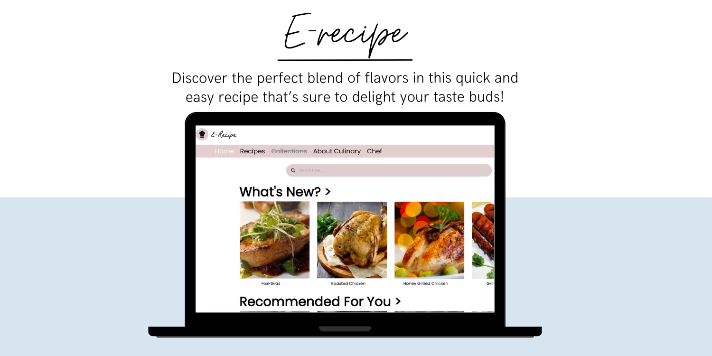

# E-recipe

eRecipe is a dedicated web application designed to provide users with a complete culinary experience through an extensive collection of recipes and detailed tutorials. Built using **HTML**, **CSS**, and **JavaScript**, the application features a straightforward and user-friendly interface, making it easy to navigate through various recipes.

---

## Table of Contents

- [Features](#features)
- [Technologies](#Technologies)
- [Website](#Website)

---

## Features:
- **Extensive Recipe Collection**: Discover a wide range of recipes catering to different tastes and preferences.
- **Step-by-Step Instructions**: Each recipe is accompanied by detailed, easy-to-follow steps.
- **Ingredient Lists**: Comprehensive ingredient lists are provided for each recipe to make preparation hassle-free.
- **User-Friendly Interface**: Although non-responsive, the layout is simple and intuitive, ensuring a smooth experience.

---

## Technologies
- **HTML**: Structured the content and layout of the application.
- **CSS**: Styled the application with a focus on clarity and usability.
- **JavaScript**: Enhanced interactivity and functionality of the app.

---

## Website
[Website](https://kevinsutrisna.github.io/E-recipe/)
